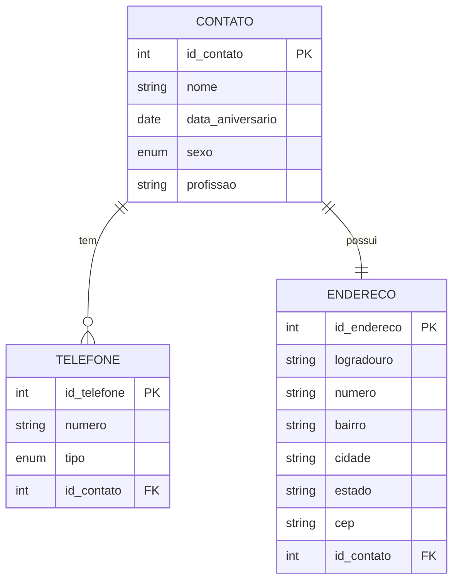

# 📘 Sistema de Gerenciamento de Contatos
> Um sistema completo para gerenciar seus contatos pessoais e profissionais


[📋 Funcionalidades](#-funcionalidades) •
[🚀 Começando](#-começando) •
[🛠️ Tecnologias](#%EF%B8%8F-tecnologias) •
[📊 Banco de Dados](#-banco-de-dados) •
[📝 Requisitos](#-requisitos)

## 🌟 Destaque do Projeto

Sistema robusto para gerenciamento de contatos com suporte a múltiplos telefones, endereços e lembretes de aniversário.

## 📂 Estrutura do Projeto

```
gerenciamento_contatos/
├── database/
│   ├── gerenciamento_contatos.db   # Banco de dados SQLite
│   └── create_tables.sql           # Script de criação de tabelas
├── sql/
│   ├── insert_data.sql            # Dados de teste
│   └── consultas.sql              # Consultas SQL
├── src/
│   ├── main.py                    # Script principal
│   └── db_utils.py                # Utilitários de banco
└── README.md                      # Esta documentação
```

## 📋 Funcionalidades

- 👤 **Gestão de Contatos**
  - Cadastro completo com dados pessoais
  - Múltiplos telefones por contato
  - Endereço detalhado
  
- 🔍 **Consultas Avançadas**
  - Busca por nome
  - Filtro por profissão
  - Pesquisa por data de aniversário

- 🎂 **Sistema de Lembretes**
  - Notificações de aniversários
  - Alertas personalizáveis

## 🚀 Começando

### Pré-requisitos

- Python 3.x
- SQLite
- Pandas

### 🔧 Instalação

1. **Clone o repositório**
```bash
git clone https://github.com/seu-usuario/gerenciamento-contatos.git
cd gerenciamento-contatos
```

2. **Configure o ambiente virtual**
```bash
python -m venv venv
source venv/bin/activate  # Linux/macOS
# ou
venv\Scripts\activate     # Windows
```

3. **Instale as dependências**
```bash
pip install pandas
```

### 🗃️ Configuração do Banco

1. **Crie as tabelas**
```bash
sqlite3 database/gerenciamento_contatos.db < database/create_tables.sql
```

2. **Carregue dados de teste**
```bash
sqlite3 database/gerenciamento_contatos.db < sql/insert_data.sql
```

## 📊 Banco de Dados

### Diagrama ER



## 📝 Requisitos

### Funcionais
- ✅ Cadastro completo de contatos
- ✅ Sistema de busca avançada
- ✅ Gerenciamento de telefones
- ✅ Controle de endereços
- ✅ Lembretes de aniversário

### Não Funcionais
- 🔒 Segurança dos dados
- 📱 Interface intuitiva
- ⚡ Alta performance
- 🔄 Escalabilidade

## 🤝 Como Contribuir

1. Faça um fork do projeto
2. Crie sua branch de feature:
```bash
git checkout -b feature/MinhaFeature
```
3. Commit suas mudanças:
```bash
git commit -m 'Adiciona MinhaFeature'
```
4. Push para a branch:
```bash
git push origin feature/MinhaFeature
```
5. Abra um Pull Request

## 📄 Licença

Este projeto está sob a licença MIT. Veja o arquivo [LICENSE](LICENSE) para mais detalhes.

## 🎯 Status do Projeto

- [x] Banco de dados implementado
- [x] CRUD básico
- [x] Sistema de busca
- [ ] Interface gráfica
- [ ] Exportação de dados
- [ ] Backup automático

---
####  
📱 Entre em contato • [LinkedIn](https://www.linkedin.com/in/joseph-neves07/) • [Email](joseph.neves07@gmail.com)

